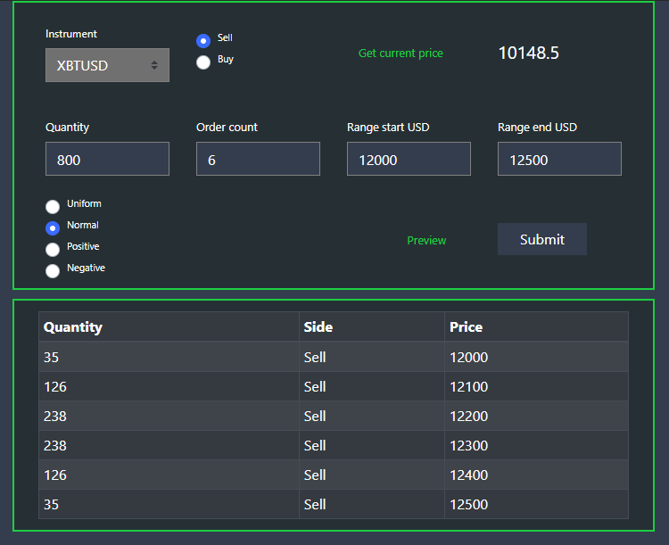
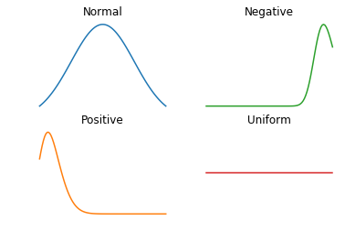

<p align="center"> 
  
</p>

## Table of Contents

- [Current Features](#current-features)
- [Built With](#built-with)
- [Getting Started](#getting-started)
  - [Prerequisites](#prerequisites)
  - [Installation](#installation)
- [Usage](#usage)
- [Distributions](#distributions)
- [Roadmap](#roadmap)
- [License](#license)
- [Useful material](#useful-material)

<p align="center"> 

</p>

# BitMEX scaled orders tool

This project is a trading tool based on **BitMEX API** to help you place orders in a range (It can also be used to overcome the overload feature on the website (although sometimes API's also get suspended due to high load)).

### Current Features

- Place up to 30 orders in a range at once _(small order sizes will cause a **spam warning**)_;
- **Uniform, Normal, Positive or Negative** order placing distributions; (see [Distributions](#distributions) section);
- Shows current price _(it is based on the latest ask price)_

### Built With

The Backend was built using **Node + Express** and the Frontend, **React + Redux**. Styled components were taken from **React Bootstrap**. API requests are made with the help of **CCXT**.

- [Node](https://nodejs.org/en/) + [Express](https://expressjs.com/)
- [React](https://reactjs.org/) + [Redux](https://redux.js.org/)
- [React Bootstrap](https://react-bootstrap.github.io/)
- [CCXT](https://github.com/ccxt/ccxt)

<!-- GETTING STARTED -->

## Getting Started

- Go to https://www.bitmex.com

  _(If you are **new** to BitMEX, consider using my [affiliate link](https://www.bitmex.com/register/o8ILy1) to get **10% off** the fees for 6 months.)_

* Get API keys:
  - Account > API keys > Create API key;
    - **Key Permissions** : Order;
    - **Withdraw**: Unchecked;

### Prerequisites

- [Nodejs](https://nodejs.org/en/download/)
- [Git](https://git-scm.com/downloads) _(for cloning the repository)_

### Installation

1. Clone the repo or [download zip](https://github.com/Effanuel/Bitmex-scaled-orders/archive/v1.0.1.zip):

```sh
git clone https://github.com/Effanuel/Bitmex-trading-tool.git
cd Bitmex-scaled-orders-master/api
```

2. Install NPM packages for client and server:

```sh
npm run init:packages
```

3. Enter your API keys in `.sample-env` _(no quotes are needed)_:

```
API_KEY = <API_KEY>
API_SECRET = <API_SECRET_KEY>
TESTNET = false
ENABLE_RATE_LIMIT = true
```

_**Disclaimer:** You need to set API keys **before building the application**. If you make a typo and only notice after a build, do_</br>
`npm run clean` and `npm build`

4. Rename `.sample-env` to `.env` (you can also change whether you want to use **Testnet**, **Rate Limit**):

_**Disclaimer:** If you set TESTNET to true, you need to create a [Testnet](https://testnet.bitmex.com/) account and set the API keys appropriately. Your main BitMEX account API won't work with TESTNET option set to true._

5. Build the application:

```sh
npm run build
```

<!-- USAGE EXAMPLES -->

#### TLDR setup:

```sh
git clone https://github.com/Effanuel/Bitmex-scaled-orders.git
cd Bitmex-scaled-orders/api
```

- Create `.env` file with API keys;

```sh
npm run init:packages
npm run build
npm run prod
```

## Usage

##### Run application:

```sh
cd Bitmex-scaled-orders/api
npm run prod
```

## Distributions

These are the available distributions to choose from:

<p align="center"> 

</p>

This is the formula used to calculate distributions:


_(The chart representations are symbolic)_

## Roadmap

- **Stepping stop-loss on target hit** using a Websocket;
- **Chasing price** for limit orders;
- Transition to **TypeScript**;
- Custom Error handling;
- Server-side Websocket client;

<!-- LICENSE -->

## License

Distributed under the MIT License. See `LICENSE` for more information.

<!-- USEFUL METERIAL -->

## Useful Material

- [BitMEX Survival Guide](https://www.crypto-simplified.com/wp-content/uploads/2018/09/BitMEX-Survival-Guide-v1.5.pdf)
- [Crypto news](https://cointelegraph.com/)
- [BitMEX position calculator](https://blockchainwhispers.com/bitmex-position-calculator/)
- [Crypto sentiment/statistics tool](https://thetie.io/)
