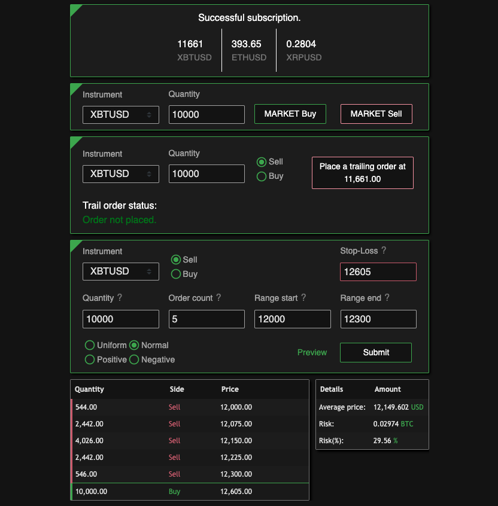
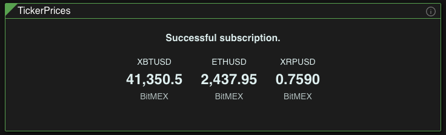
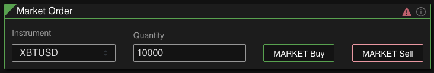
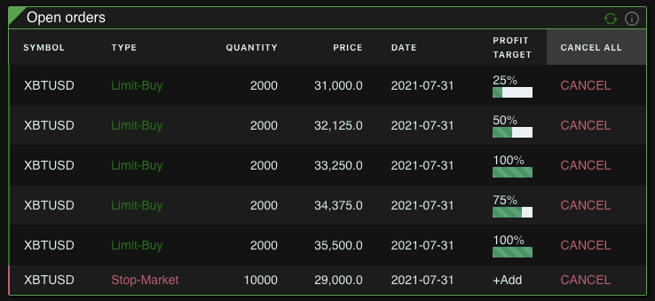

<p align="center">
  
</p>

## Table of Contents

- [Current Features](#current-features)
- [Built With](#built-with)
- [Getting Started](#getting-started)
  - [Prerequisites](#prerequisites)
  - [Installation](#installation)
- [Usage](#usage)
- [Distributions](#distributions)
- [Roadmap](#roadmap)
- [License](#license)
- [Useful material](#useful-material)

# BitMEX trading tool

This project is a trading tool based on **BitMEX API**. This project has a long way to go before becoming an actual usable tool. If you notice any bugs, open an issue.

### Current Features

- **Scaled orders:**

  - Place up to 30 orders in a range at once _(BitMEX limit)_

  - **Uniform, Normal, Positive or Negative** order placing distributions; (see [Distributions](#distributions) section);

  - (Optional) You can also add a stop-loss;

  - "Preview" displays your scaled order, average entry and possible risk if stop-loss is provided.

    <p align="center">
      
    </p>

- **Shows current prices:**

  - Based on the latest ask price;

  - Fetched via **Websocket**;

  - BTC, ETH and XRP (currently).

<p align="center">
	
</p>

- **Market Order:**

  - Place a sell or buy market order;
  - Faster over using the website.

<p align="center">

</p>

- **Trailing Order:**

  - Places a trailing limit order near market price;

  - The order is ammended automatically, so the order moves with the price if it doesn't get filled;

  - You can use it to get your fills without doing a market order and paying fees, or
    you can push markets with it.

    <p align="center">
      
    </p>

- **[Cross Market Order:](https://github.com/Effanuel/BitMEX-scaled-orders/pull/26)** _(currently disabled)_

  - Ability to add a cross order;
    - if you set a sell cross price below current price, it will trigger a market sell order as soon as the price crosses your cross order price;
    - if you set a buy cross price above current price, it will trigger a market buy order as soon as the price crosses your cross order price;
    - if you set a sell cross order price above current price, it will trigger a market sell order when the current price crosses up and then down of the set cross price;
    - if you set a buy cross order price below current price, it will trigger a market buy order when the current price crosses down and then up of the set cross price.

- **Open Orders:**

  - See currently open orders;
  - Add profit targets for open orders (uses limit stop-loss orders to achieve that);
  - Cancel any open/profit order(s);

<p align="center">
  
</p>

### Built With

The Backend was built using **Node + Express** and the Frontend, **React + Redux**. Styled components were taken from **Chakra UI**

## Getting Started

- Create a [BitMEX](https://www.bitmex.com) account;

  _(If you are **new** to BitMEX, consider using my [affiliate link](https://www.bitmex.com/register/o8ILy1) to get **10% off** the fees for 6 months. If you are someone who doesn't gets his orders filled with market orders, getting the 10% discount also reduces the money you get back for limit orders. So it is not recommended)_

* Get API keys:
  - Account > API keys > Create API key;
    - **Key Permissions** : Order;
    - **Withdraw**: Unchecked;

### Prerequisites

- [Nodejs](https://nodejs.org/en/download/)
- [Git](https://git-scm.com/downloads) _(for cloning the repository)_

### Installation

1. Clone the repo:

```sh
git clone https://github.com/Effanuel/Bitmex-scaled-orders.git
cd Bitmex-scaled-orders-master/
```

2. Enter your API keys in `.env` _(no quotes are needed)_:

```sh
REACT_APP___API_KEY =
REACT_APP___API_SECRET =
REACT_APP___TESTNET = false
REACT_APP___LOG_LEVEL = info
```

3.  Install NPM packages for client and server:

```sh
cd api/
npm run init:packages
```

_**Disclaimer:** You need to set API keys **before building the application**. If you make a typo and only notice after a build, do_</br>
`npm run clean` and `npm build`

_**Disclaimer:** If you set TESTNET to true, you need to create a [Testnet](https://testnet.bitmex.com/) account and set the API keys appropriately. Your main BitMEX account API won't work with TESTNET option set to true._

4. Build the application:

```sh
npm run build
```

  <!-- USAGE EXAMPLES -->

#### TLDR setup:

```sh
git clone https://github.com/Effanuel/Bitmex-scaled-orders.git
cd Bitmex-scaled-orders/
```

- Put API keys in `.env`

```sh
cd api/
npm run init:packages
npm run build
npm run prod
```

## Usage

##### After building you just need to run the application:

```sh
cd Bitmex-scaled-orders/api
npm run prod
```

## Distributions

These are the available distributions to choose from:

  <p align="center">
  
  </p>

Probability density function is used to calculate distributions:


</br>

## Roadmap

- **Faster price update**;
- Stepping stop-loss;
- Custom order/profit target placement;
- Bitfinex/Binance API;
- Easier API setup;
- Multiple accounts for every platform;
- Saving cache;
- Settings for multiple ticker subscriptions;

  <!-- LICENSE -->

## License

Distributed under the MIT License. See `LICENSE` for more information.

  <!-- USEFUL METERIAL -->

## Useful Material

- [BitMEX Survival Guide](https://www.crypto-simplified.com/wp-content/uploads/2018/09/BitMEX-Survival-Guide-v1.5.pdf)
- [Crypto news](https://cointelegraph.com/)
- [BitMEX position calculator](https://blockchainwhispers.com/bitmex-position-calculator/)
